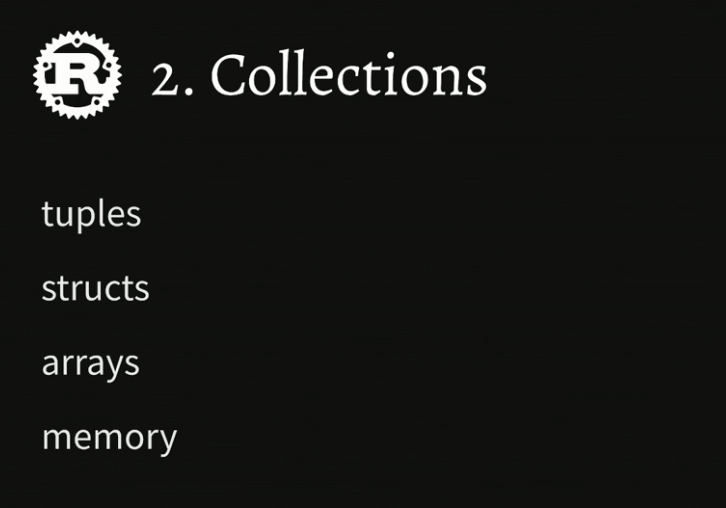
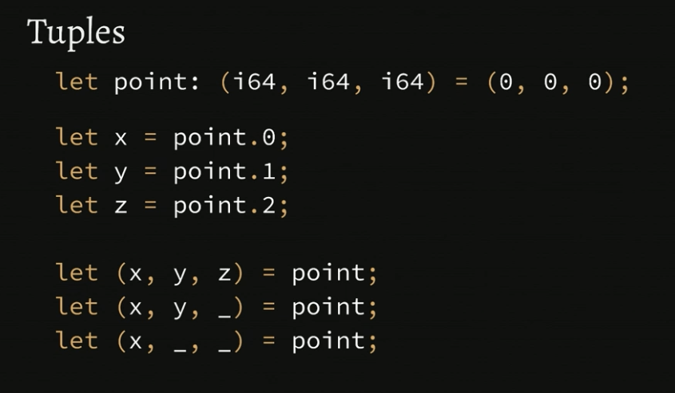
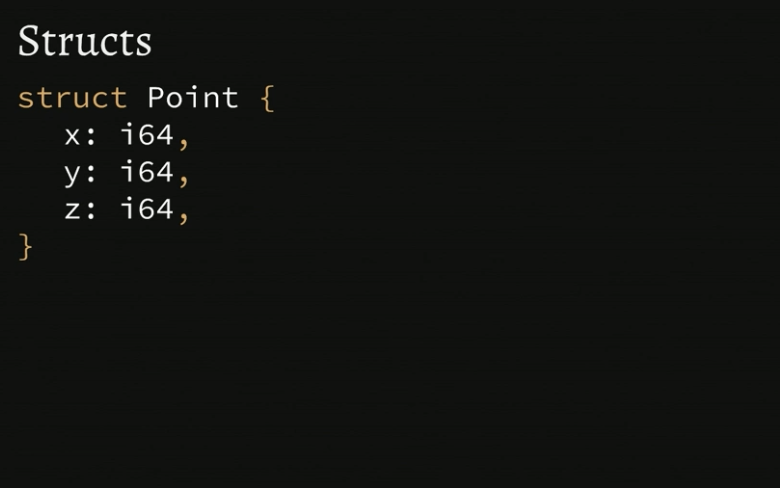
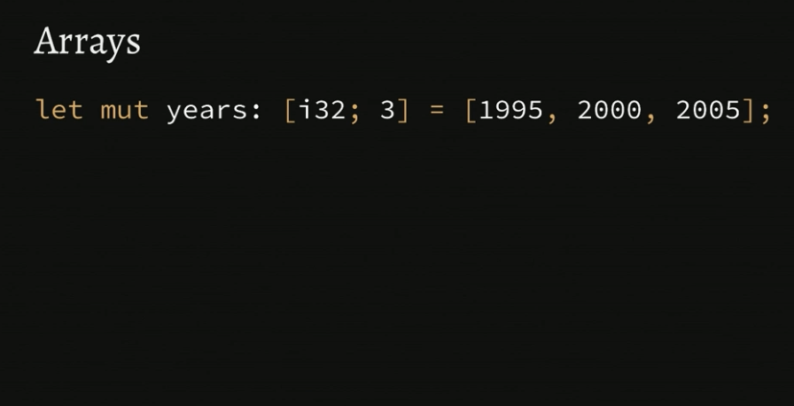
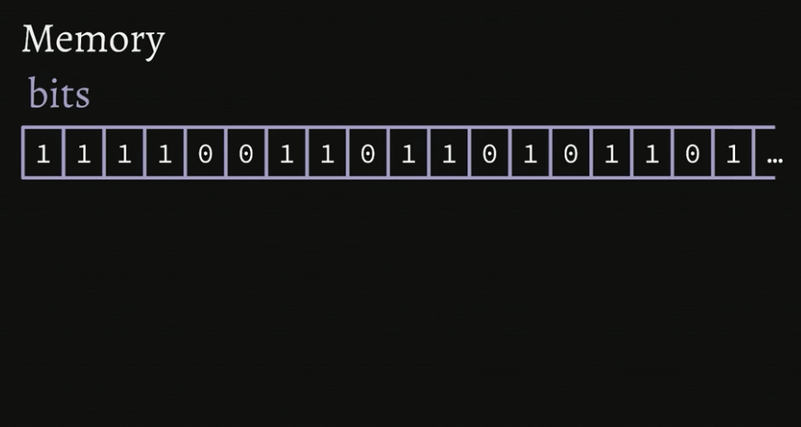

<h1 align="center"> </br> Collections </h1>

<h3 align="center">This chapter highlights the primitive collections in Rust </h3>



###  Table of Contents
  - [Tuples](#tuples)
  - [Structs](#structs)
  - [Arrays](#arrays)
  - [Memory](#memory)
  - [Collections Recap and Q & A](#collections-recap-q-a)
  - [Collections Exercises](#collections-exercises)

---


### Tuples



<details>
  <summary>Learn More..</summary>

  - A Tuple is a way to structure data, tuples exist in other programming languages as well
    - To create a `Tuple` in rust we use parenthesis and add items, seperated by a comma i.e `(1,2,3)` <- this is a tuple
    - in the below example we declare a tuple with 3 values of types i64
    - The number of values in your tuple can be 3 as below or lower or higher
    - you can mix and match value types within a single tuple
    - to read a value from a tuple, rust uses dot notation, similar to an obj or class reference in js or python `nameOfTuple.index`
    - destructuring is another way to read a value or values from a tuple i.e `(val, val) = nameOfTuple;`
    - the `_` prefix can be passed in when destructuring to tell the compiler i am not interested in the value at this position, in the below example we get the first two items in the tuple and leave the last out
      - you can use as many underscores when destructuring


  ```rs
   let point: (i64, i64, i64) = (0,0,0)

   let x = point.0; // references the first value in the tuple
   let y = point.1;
   let z = point.2;

   let (x,y,z) = point; // reference each value in the tuple
   let (x,y,_) = point; // only get the first two items in tuple
  ```

  - *What about mutation? Arent all variables immutable by default?*
    - all values are immutable by default in rust, to mutate a tuple the `mut` keyword must be used
    - `let mut` allows us to reassign the value of point but also change the individual values of the tuple
    ```rs
      let mut point: (i64, i64, i64) = (0,0,0);

      point.0 = 17;
      point.1 = 42;
      point.2 = 90;
    ```

    - *Unit*
      - A unit is a special tuple
        - a unit is a 0 tuple, essentially a tuple with nothing in it
        - you can never have more than one as they are garuanteed to have one item at run time, units have a fixed number of slots that are always constant throughout the life of your pogram

    - *What is point of a unit/0 tuple*?
      - In rust every function is required to have a return type, in the case your function does not return a value or should not a unit or 0 tuple comes in handy
      - the example below shows how under the hood rust returns a 0 tuple on the main function since all rust functions must 'return' a value
      - to set a unit as the retun type, annotate the function with `()` empty parenthesis
      - this is simlar to void in other languages

      ```rs
       let unit: () = ();

       fn main() {
        // do something
       }

       fn main() -> () {

       }

       let println_return_val: () = println!("Hi");
      ```

</details>


### Structs



<details>
  <summary>Learn More..</summary>

  - A **Struct** is a way to structure data, similar to objs/dicts in other languages, structs structure data using key,value pairs.
    - to create a struct in rust you use the `struct` keyword followed by the name of the Struct capitalized and define the struct content using key value pairs wrapped in curly braces i.e `struct Point { x: 1, y: 2  }`
    - the struct syntax and definition is similar to an object in other languages
    - In a struct the length of fields and the values added to a struct are fixed and can not be changed at run time
    - structs can be nested
    - to read a value from a struct, rust uses dot notation and destructuring to pull values

    ```rs
       // define a Struct named point
        struct Point {
            x: i64, // set the names of the content and the value types
            y: i64,
            z: i64
        }

        let point = Point { x: 1, y: 2, z: 3 } // populat the struct
        let x = point.x; // get the value of x from the struct
        let Point { x, y, z } = point; // get all values using destructuring
        let Point {x, y: _, z } = point; // omit y from returning using the _
        let Point {x, z, .. } = point; // omit every field except x and z w. ..
        let Point {x , .. } = point; // omit every other field except x
    ```
    - We can construct/add values to structs using functions
      - in this example we define the Point struct and in the function which returns the struct we are able to pass in the args from the function to the struct as the values
      - Rust supports the shorthand for settings key value pairs as shown in the second function.. since we know the value ref is the same as the key we can simply say `{ x, y, z }` instead of `{x: x, y: y, z: z}`.
    ```rs
        struct Point {
            x: i64,
            y: i64,
            z: i64
        }

        fn new_point(x: i64, y: i64, z: i64) -> Point { // return Point
            Point {x: x, y: y, z: z} // references Point
        }

        fn new_point_shorthand(x: i64, y: i64, z: i64) -> Point {
            Point { x, y, z }
        }
    ```
    - *What about mutation? Arent all variables immutable by default?*
      - all values are immutable by default in rust, to mutate a struct the `mut` keyword must be used
      - `let mut` allows us to change the individual values of the struct
      - mutations mutate the original point, so the existing reference to Point not a copy
    ```rs
        struct Point {
            x: i64,
            y: i64,
            z: i64
        }

        let mut point = Point { x: 1, y: 2, z: 3 };
        point.x = 5 // change x from 1 to 5
    ```

</details>

### Arrays



<details>
  <summary>Learn More..</summary>

  - An **Array** is a way to structure data into a list
    - to create an array in rust you set the var type using `:[]` i.e `let mut years: [i32, 3]` the first arg of the [] is the type all elements in the array will be and the second arg is the length of the array, in this case its 3.. meaning only 3 items can ever be added to the years array
    - you can not mix and match element types in arrays like in tuples and structs.. all items in the array must be of the same type
    - to read a value from an array we can use indexing, rust also supports destructuring to get array elements
    - arrays also have a hard coded length at compile time
      - rust does have an example of dynamic arrays that can grow and shrink
    - arrays in rust are similar to arrays in C, different from what an array is or refers to in languages like javascript etc.

    ```rs
        let mut years: [i32; 3] = [1995, 2000, 2005];

        let first_year = years[0] // getting the elemnt at the 0 index

        // omitting the elem at the 0 index and getting the elems at the 1 and 2 index and assigning them to vars named second_year and third_year respectively
        let [_, second_year, third_year] = years;
    ```

    - *What about mutation? Arent all variables immutable by default?*
      - all values are immutable by default in rust, to mutate an array the `mut` keyword must be used
      - `let mut` allows us to change the individual values of the array
      - mutations mutate the original array, so the existing reference to array not a copy
    ```rs
        let mut years: [i32; 3] = [1995, 2000, 2005];

        years[2] = 2010; // reassigning item at the 2 index to 2010
        years[x] = 2010; // when using vars to get values from an array if out of bound program will panic
    ```

    - Arrays are iterable in rust, similar to other languages
      - the example below iterates over the array and at each element says print the next year

      ```rs
        let mut: years: [i32; 3] = [1995, 2000, 2005]

        for year in years.iter() {
            println!("Next year: {}", year + 1)
        }
      ```

    - *Arrays vs Tuples*
      - arrays have a fixed type, because of this we can iterate over the array
      - tuples are not iterable
      - tuples are more flexible in that the element types are not fixed nor are tuple lengths

    ```rs
      let mut years: [i32; 3] = [1995, 2000, 2005];

      for year in years.iter() {
        println!("Next year: {}", year + 1)
      }
    ```

</details>


### Memory



<details>
  <summary>Learn More..</summary>

  - This section is meant to be stepping stone into building an understanding of rusts borrow checker, which will be covered in a later section

  - *How does memory work?*
    - You can think of memory as a bunch of bits
      - a bit refers to a 0 or 1
      - the memory in your computer is a big list of zeros and ones
      - programs interpret a sequence of zeros and ones that then comprise of what we know as a string or number etc.
      - the smallest `unit` of memory in a computer is a `byte`


  - I decided not to write notes on the memory section since it is difficult to encapsulate how memory works on a computer in a useful way in a few bullets
    - Week 4 of harvard cs50 breaks down how memory works [HarvardCS50](https://www.youtube.com/watch?v=LfaMVlDaQ24)

  - At runtime rust can be faster than other languages because of how it manages memory between data structures and how they are stored
    - i.e arrays, structs and tuples are stored in memory the same way
    - the different collections are more syntactic sugar in rust than actual structures, this means at compile time when working with Rust you get some semantic differences according to what code you need in the moment but at run time all the 'structures' are the same so rust can have 0 costs on performance regardless of how the developer chooses to structure the data the program needs to run


</details>


### Collections Exercise

[Exercise](../rust-1.51-workshop/part2/)
