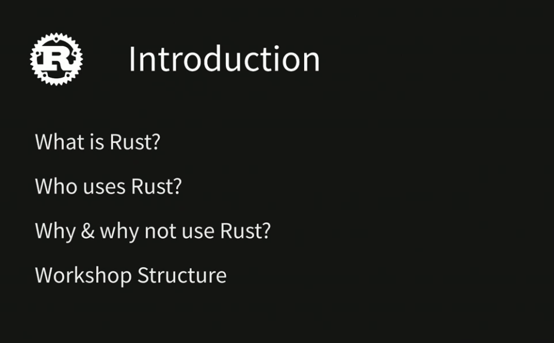
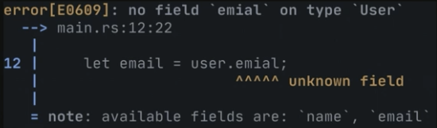
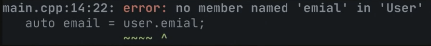
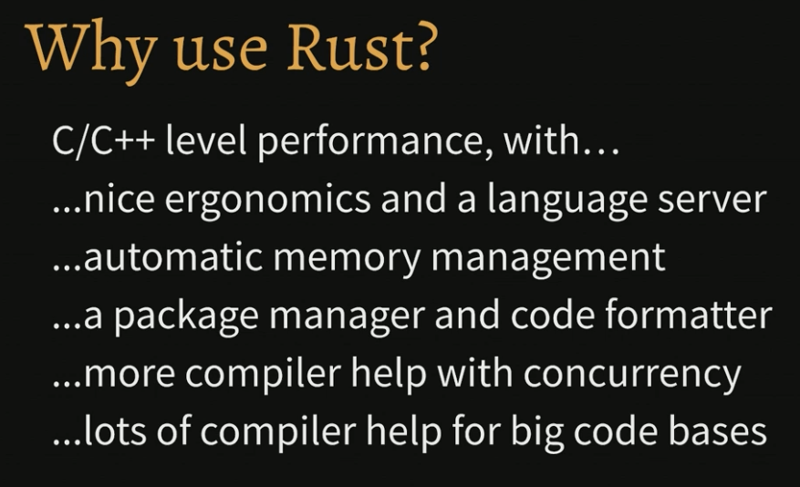
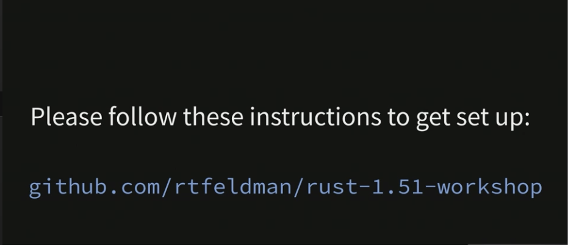

<h1 align="center"> </br> Introduction</h1>

<h3 align="center">This chapter introduces the language and covers what to expect from this course</h3>

###  Table of Contents
  - [Introduction](#introduction)
  - [What we'll cover](#what-we'll-cover)
  - [Prerequisites](#prerequisites)

## Introduction


<details>
 <summary>Learn More..</summary>

 - **What is Rust?**
    - from _rust-lang.org_
      - "A language empowering everyone to build reliable and efficient software."
    - **Rust compiles to either**
     - *machine code* (01110101101011001111)
       - Compiles to a binary exectuble -> `.exe` on windows linux, or macos
       - Rusts compiler is built on top of llvm which is also used by languages like c, c++ and swift
     - *WEBASSEMBLY (WASM)*
      - WASM lets you run Rust in the browser
    - **Rust does not support cross binary compilation (can you use your macbook to package a rust binary for mac as well as windows and linux)**
      - To accomplish this your program must be run on each device to be packages for that os
      - VM usage are more common to accomplish this

 - **Who uses Rust?**
    - All sorts of orgs use Rust
     - The most notable is `moz://a`, they were bank rolling rust dev for the first decade of its life
     - `Microsoft` are currently rewriting alot of its system code in Rust
     - `Dropbox` has been using rust to improve some perf with their syncing engine
     - As well as many other big and small companies across various domains
- **What can I build with Rust**?
  - *Web Servers*
  - *Command-Line Interfaces*
  - *build tooling, used to build frontends*
  - *Native desktop applications*
  - *In-browser apps via WebAssembly*
  - *https://makepad.dev (fully featured ide that runs 60fps on your phone)*
  - *Performance-intensive libraries*
  - *Operating Systems(!)*

- **Why Use Rust?**
  - *Speed*
  - *Performance*
  - *Going Real Fast*
    - Rust unlocks the maximum speed you can get out of your hardware

  - **High Performance Language Timeline**
    - *1972*
      - `C` came out in 1972 and is still widely used because of its unmatched performance, it is often referred to as a portable webassembly because its about as low level as you can get and get complete control of your hardware
    - *1985*
      - `C++` is one of the most popular and high performing languages out there, one of the main goals of `c++` was to introduce OOP to `C` while still maintaining the level of control and performance as `C`
    - *2010*
      - The first serious challenger to the throne of `C` and `C++`, `Rust`. Very efficient, almost nothing between a compiled rust program and what the hardware is capable of without the OOP approach `C++` took. Rust focuses on being `efficient, reliable and ergonomic`.

 - **Rust vs C++ Error Comparison**
  

    - This is an error from the rust compiler if a field is mis spelled

    

    - this is the same error type in c++
    - the c++ error provides less information and guidance on resolving the error

  - *This difference can be extrapolated out to more complicated errors, Rust will provide a must more fun experience than the high tier performance languages traditionally used like c, c++*

- *In Conclusion*
  

- **Why Not Use Rust?**
  - *Rust is a big language - lots to learn!*
    - I.e This is an introductary course, it will not cover rust its an entirety. Although by the end it should provide a good understanding the basics of Rust and enough to build a full fledged app and have a way easier time learning the more in depth `Rust` Features
  - *Smaller ecosystem than `C/C++` (but FFI)*
    - `C/C++` Have been around for a lot longer than Rust so this is to be expected, if working on really intractive systems development a larger ecosystem around that work may be beneficial
     - *Foreign Function Interface*
       - This is a way to call C and C++ code from Rust, but using FFI means losing some of the ergonmc safety gaurantees Rust provides
       - It is much nicer to have everything in Rust so FFI are usually avoided by Rust devs unless absolutely needed
     - This prompts people to build entire OS in Rust etc.
  - *Slower Iteration cycle than most languages*
    - Not slower than c++ for example, but most languages iterate and compile very fast and so Rust in comparison is viewed as slow, this is due to ->
      - strict compiler (helps devs build reliable software by telling you when there are problems with the code implementation NOT by papering over problems)
      - satisfying ("fighting") the borrow checker (it can feel like fighting the compiler to resolve these borrow checker errors that are unique to Rust)
        - this course will help to provide a mental model around what the borrow checker is actually doing as this is a major pain point for most devs coming into Rust
      - slow compile times for full builds
        - does not look like there is hope for the compiler to get better or faster
      - tests can take awhile to build
      - *What specifically makes the compiler slow?*
        - There is not one particular thing, it is a culmination of various design decisions made by the Rust team

 - *Safer than C++, less safe than e.g pure FP*
  - If you do not need the level of performance that Rust offers or languages like C and C++ offer i.e writing a game engine, those other languages will be 'safer' options and sufficient
   - the main reason to use Rust is for top tier performance

**Rust stacked against other languages**
 - Check out the stackoverflow surveys most loved programming language, Rust wins this category wins every year
</details>


## Prerequisites


### Workshop Repository: [rust-1.51-workshop](https://github.com/rtfeldman/rust-1.51-workshop/)


### You will need to install: [Rust](https://www.rust-lang.org/tools/install) 1.51 or higher

### You will need to install: [Cargo](https://doc.rust-lang.org/cargo/getting-started/installation.html) 1.51 or higher

### Verify that you have the right version of cargo by running:

```shell
cargo --version
```
It should print a version of number 1.51 or higher.

### You will need an IDE: [Cursor](https://cursor.com)
