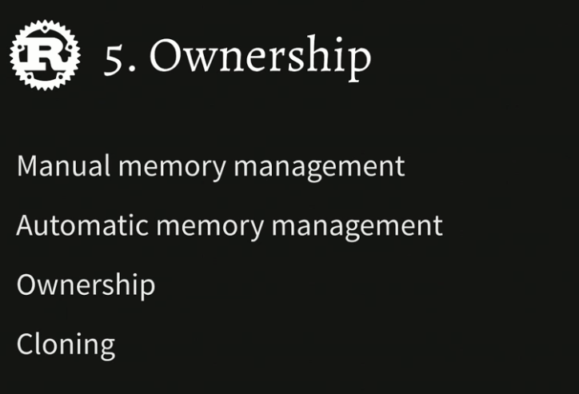
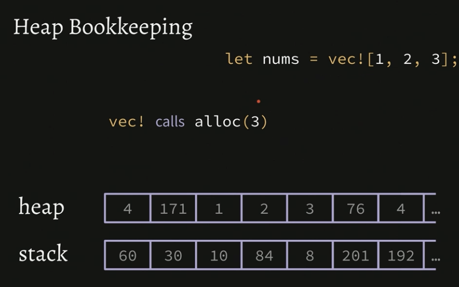
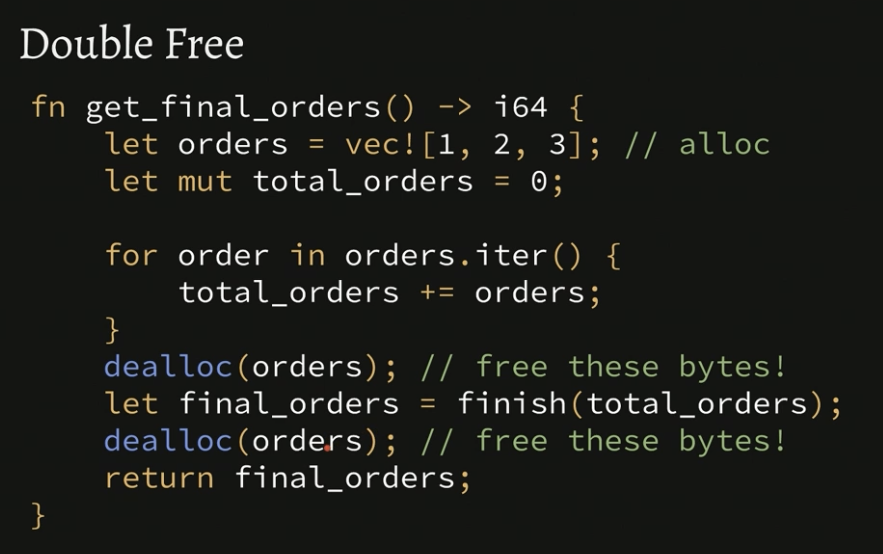
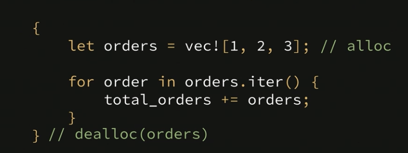
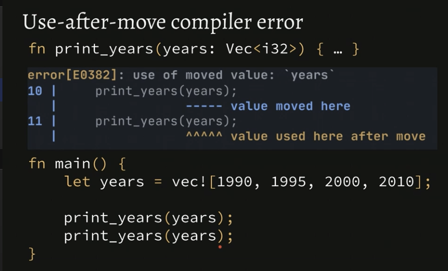

<h1 align="center"> </br> Ownership </h1>

<h3 align="center">This chapter covers ownership in Rust</h3>



###  Table of Contents
  - [Heap Bookkeeping](#heap-bookkeeping)
  - [Manual Memory Management](#manual-memory-management)
  - [Rust Memory Management](#rust-memory-management)
  - [Ownership](#ownership)
  - [Ownership Recap & Memory Exercise](#ownership-recap-memory-execution)


### Heap Bookkeeping



<details>
  <summary>Learn More..</summary>

  - *Heap Bookkeeping*
    **Allocating Memory**
    - Whenever the vec! macro is run it calls a method called alloc (short for allocate) i. `vec! alloc(3)`
    - Allocation can refer to the stack or the heap but is most commonly used in reference to the heap
      - It is a common technique in performance optimization to say "reduce allocation" - this typically refers to reducing allocation made on the heap aka memory reserved on the heap for some item
        - i.e in the previous section vecs were covered, and under the hood when using a vector to store data a capacity is automatically set on the heap to reserve some slots in memory for the values that will be added to the vector list
    - Heap allocations can be expensive
      - Heap allocations are not built into the hardware, so running alloc is a non-trivial operation

    - **De-allocating memory**
      - How does a program know to mark memory on the heap as no longer in use?
        - i.e on the stack the stack length gets higher and lower as items are added, once the execution of the function adding and referencing those bytes on the stack is over the items become *Garbage* and any new items are added again to the front of the stack
      - The process of deallocating memory or telling the program when some bytes on the heap are no longer in use requires [manual memory management](#manual-memory-management), covered in the below section

</details>

### Manual Memory Management



<details>
  <summary>Learn More..</summary>

  - *Manual Memory Management*
    - Memory management usually refers to the question: *When is it safe to mark something on the heap as no longer in use?*
      - lets take the example below
        - Most logic in the `get_final_orders` fn works with the stack, the orders vector requires the heap to store its elements
        - the `orders` vec makes a call to alloc, when the 4 bytes users for `1,2,3,4` are no longer in use the program needs a way to tell the bookkeeping system to free up this memory or de-allocate the memory
        - *Option 1*: never de-alloc allow memory to pile up
          - This can cause *Memory Leaks* as the memory usage of the program increases, users cpu will get really slow etc.
        - *Option 2*: de-alloc
            - *In C, this is done using malloc() and free() methods to allocate and deallocate memory as needed throughout the program*
              - This is a sensitive operation, in which placing the dealloc method in the wrong place in code can cause different functions running in parallel to allocate memory in the same place, i.e if in the `get_final_orders` fn below dealloc was added after total_orders it is possible that another function could then add vals to the same place, the next line the program iterates over the orders vec, since the memory allocated is immediately deallocated the orders iterator will iterate over w.e values are in those slots this is called a `use-after-free` bug
              - `Double-frees` are anothe type of bug that can occur when dealing with manual memory management that can be a result of over deallocating in a program

        - *Option 3*: Rust automatic memory management system
         - Fortunately Rust does not ask its developers to do manual memory management
           - Rust internally handles the dealloc and figured out where to insert the de allocation so there are no changes of double-frees and use-after-frees.. **yay**!

        - *Option 4*: Garbage Collection
         - Most high level languages have what is known as a garbage collector
           - Garbage collection has additional overhead per allocation than the type C, C++ and Rust
             - At some point the garbage collector goes to track down everything that has been allocated (GC-Pass) causes a GC pause and this takes time, memory and performance spikes.. this is common and many charts on the effects of GC are publicly available

    - *Memory management has to major implication if not done correctly (it is difficult to do correctly even for the most seasoned engineers)*
      1. Performance
      2. Security Vulnerabilities
        1. Microsoft put out a study of where most of their security vulns came from and they found mostly double-frees, use-after-frees and buffer overuns

     


      ```rs
        fn get_final_orders() -> i64 {
            let orders = vec![1, 2, 3, 4]; // calls to alloc
            let mut total_orders = 0;

            for order in orders.iter() {
                total_orders += orders;
            }

            let final_orders = finish(total_orders);

            return final_orders;
        }
      ```
</details>


### Rust Memory Management





<details>
  <summary>Learn More..</summary>

  - *How Rust Manages Memory w.o Garbage Collection*
    - Rust inserts the dealloc method for us the same way you would if writing C when some reference goes out of scope (once it can no longer be accessed)


    ```rs
    fn get_final_orders() -> i64 {
        let orders = vec![1, 2, 3, 4]; // calls to alloc
        let mut total_orders = 0;

        for order in orders.iter() {
            total_orders += orders;
        }

        let final_orders = finish(total_orders);
        // dealloc(orders) -> automatically inserted by rust compiler
        return final_orders;
    }
    ```
    - *What if dealloc can be inserted sooner in the program while still being safe and 'out of scope'?*
      - Rust supports anonymous scoping by wrapping what is to be allocated and the logic over it in curly braces
      - This is not common usecase but available to get some level of control over dealloc

     ```rs
    fn get_final_orders() -> i64 {
        let mut total_orders = 0;

        {
            let orders = vec![1, 2, 3, 4]; // calls to alloc

            for order in orders.iter() {
                total_orders += orders;
            }
        } // dealloc(orders)

        return finish(total_orders);
    }
    ```

</details>

### Ownership




<details>
  <summary>Learn More..</summary>

  - *Memory Management Edge Cases*
    - In the example below, the get_years fn is called in main and set to a new reference `years`, since the memory has been deallocated for `years` in the fn get_years without ownership rusts internal insertion of dealloc would cause the same memory issues that can occur when manually managing memory
      - Ownership is rusts way of dealing with the many edge cases that can occur when managing memory

   ```rs
     fn get_years() -> Vec<i32> {
        let years = vec![1995, 2000, 2005, 2010]; // alloc
        return years;
     } // dealloc(years) because it went out of scope

     fn main() {
        let years = get_years(); // use after free bug
     }

   ```

   - *Ownership*
     - Ownership in rust refers to whose responsibility is it (what bit of code in the program) to deallocate the memory of some val(s)
       - Whenever Rust allocates memory it assigns an "Owner" to that allocation i.e `years` var in the `get_years()` function owns the allocation of the vector
       - Any time a program/function returns something that has been allocated aka ownership has been assigned that ownership is transferred to the new var that references the function i.e the `years` vector is returned so the ownership of the allocated years vector will then be transferred to w.e variable in the program references `get_years()` in the future, in the example below the main function references `get_years` so it now as has ownership of what the function returns (the years vector)
         - This is known as a 'move' in rust, in the example below we are saying ("move" **years** to **main**'s scope)
       - In the case there is no other code to transfer the ownership to it just deallocates the memory as normal


     ```rs
        fn get_years() -> Vec<i32> {
            let years = vec![1995, 2000, 2005, 2010]; // alloc (this scope "owns" years)
            return years; // transfer ownership to main
        }

        fn main() {
            let years = get_years();
        } // dealloc(years)
     ```

     - *How does ownership work when passing params to functions?*
       - When a fn is declared with a param rust knows the function itself will take ownership of the param/value from the caller of the function
         - in the example below the `print_years` function takes ownership of the `years` vector from main, so that it can be deallocated when it goes out of scope
        - *What happens if print_years is called twice?*
          - The first print_years call in main executes the function AND deallocates the memory, so calling print_years back to back could cause a use-after-free bug
          - Rust has a compiler error to inform you that printing years twice is a wrong use of memory and this operation can not be done
           - this is a *Use After Move* error in Rust (this is specific to rust)
           - Rusts compiler is preventing use-after-free bugs this way

            ```rs
            fn print_years(years: Vec<i32>) {
                for years in years.iter() {
                    println!("Year: {}", year);
                }
            } // dealloc(years) since the ownership was transferred and we are at the end of the scope

            fn main() {
                let years = vec![1990, 1995, 2000, 2010]; // years allocs memory on the heap for vector

                print_years(years); // this call transfers ownership from the years var to the print_years function
                print_years(years); // this second call causes a compiler error
            }
            ```
            - With this in mind, if we do want to do something like make multiple function calls on the same reference, you have to pass around ownership and convince the compiler NOT to free up the memory, this builds on top of the ownership flow when returning items
              - The below example shows how ownership can be passed and prevent memory freeing if the vals should be used again in Rust to get around the compiler error (*note a more elegant approach to this will be covered in later sections (clone)
              - Simply return years/the val (remember returning some val transfers ownership to whatever code calls the function)
              - Note that following this pattern to move ownership around the `years2` and `years3` naming conventions are needed, even though print_years returns years Rust will consider the `years` vector as consumed so the ownership must be transffered and reassigned to a new var

            ```rs
            fn print_years(years: Vec<i32>) -> Vec<i32>{
                for year in years. iter() {
                    println! ("Year: {3", year);
                }

                return years; // transfer ownership to the caller's scope
            }

            fn main () {
            let years = vec! [1990, 1995, 2000, 2010];

            let years2 = print_years(years) ; // transfers ownership to print years
            let years3 = print_years(years2) ; // reference years2 which return years making at available to be transferred to years3 and so on
            }
            ```

            - **.clone() is your friend**
              - clone is another option when looking to pass around ownership and remove the compiler error
                - the .clone() method basically says make a complete copy of this item, in the example below `print_years` will deallocate w.e it is given
                - the .clone() method says keep the `years` vec in scope and only pass in a clone/copy of years into the print_years fn instead of the original allocation
                - When print years is finished the **clone** is deallocated not the original years declared in main
                - Since we still have access to the original years allocation, simply call it again and no compiler issues
              - *Tradeoffs*
                - Calling .clone() on an item resolves memory management issues fairly quickly
                - A performance cost does come with using .clone()
                  - Richard Feldman recommends that as a beginner using .clone() is a way to get unstuck when coming across errors in rust that are foreign and can slow down development if some more in depth implementation is needed to resolve
                    - Once Rust is better understood, retracing implementations of .clone() and removing them will not be a problem
                    - As a beginner you sacrifice some performance to move along in development and then come back fix things up when able

              ```rs
                fn print_years(years: Vec<i32>) {
                    for years in years.iter() {
                        println!("Year: {}", year);
                    }
                } // dealloc(years) since the ownership was transferred and we are at the end of the scope

                fn main() {
                    let years = vec![1990, 1995, 2000, 2010]; // years allocs memory on the heap for vector

                    print_years(years.clone()); // makes a complete copy of all the contents of years
                    print_years(years); // this second call causes a compiler error
                }
            ```

</details>


### Memory Exercise
[Memory Exercise](../chapter-exercises/part5/)
