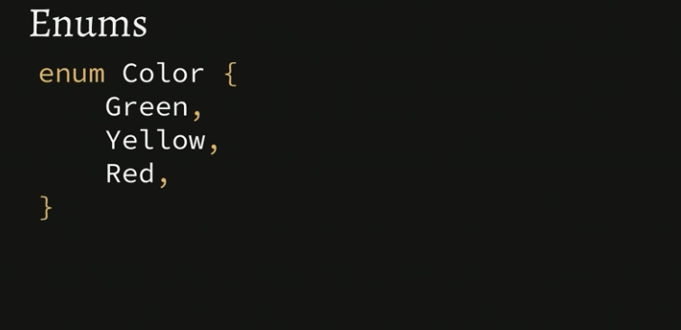
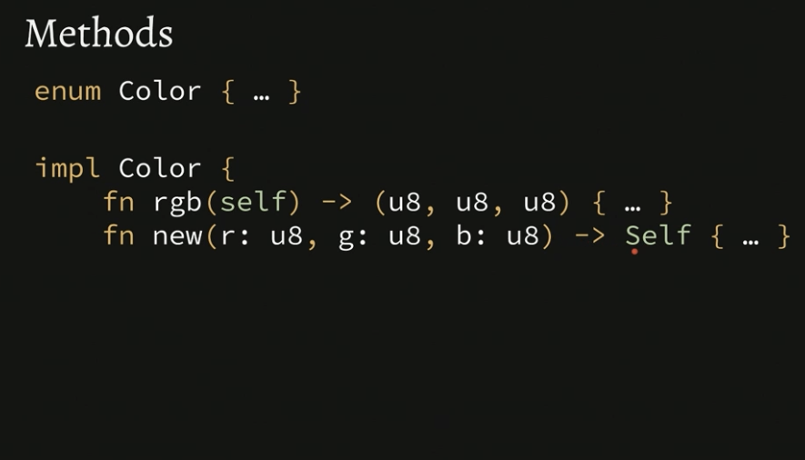

<h1 align="center"> </br> Enums & Pattern Matching</h1>

<h3 align="center">This chapter enums & pattern matching in Rust</h3>


###  Table of Contents
  - [Enums & Pattern Matching](#enums-pattern-matching)
  - [Methods](#methods)
  - [Type Parameters](#type-parameters)
  - [Pattern Matching Recap and Q & A](#pattern-matching-recap-q-a)
  - [Pattern Matching Exercise](#pattern-matching-exercise)


### Enums & Pattern Matching



<details>
  <summary>Learn More..</summary>

  - *Enums*
    - In Rust enums are a way to set
      - To create an enum in Rust we use the `enum` keyword followed by type  of
        enum aka the name capitalized, then curly braces wrapping the enum variants aka values
        - to instantiate the enum on a var rust uses a double colo syntax `::` i.e `Color::Green` call the enum type and select the variant to instantiate with
      - Enum is short for enumaration
      - Enums in Rust work a bit different than enums in typescript or python
      - Enums can store custom variants that take data called a payload, using struct
        like syntax.. its essentially a struct stored in an enum
        - Enums can store custom variants as tuples instead of structs (unlike normal tuples, in enums tuples can have only one value)

  ```rs
    enum Color { // type is the name followed by enum
        Green, // each value in the enum is the variant of the type
        Yellow, // Yellow variant of type Color
        Red, // Red variant of type Color
        Custom { red: u8, green: u8, blue: u8 } // enums can store custom variants
        Custom(u8, u8, u8) // enums can store custom variants as tuples

    }

    // the type of each var is Color (the enum), it is inferred based on the value so no need to explicity add the type i.e `go:Color`
    let go = Color::Green;
    let stop = Color::Red;
    let slow_down = Color::Yellow;
    let purple: Color = Color::Custom {
        red: 100, green: 0, blue: 250
    }; // using struct version of custom variant
    let green: Color = Color::Custom(100, 0, 250) // using tuple version of custom variant
  ```

  - *Pattern Matching*
   - In Rust, to get values from enums pattern matching is used
     - what is pattern matching?
       - pattern matching in Rust is a way to conditionally run some set of logic based on a matched value.. works similarly to switch in js and other languages
       - to create a match Rust uses the `match` keyword, similar to creating a
         switch in js using the `switch` keyword
         - following the match keyword, we give the match a value to watch, in the
           below example the match watches the `current_color` var (similar to providing a (case) in js switch case statement)
       - then provide the patterns, a match similar to a switch case will look through all the cases/patterns until one that matches the var being watched is found then it will run the logic wrapped in that case/pattern
         - in the below example `current_color` is watched, the patterns are a couple of Color enums.. once the match hits yellow, since the var current_color is the Yellow enum it will print to the console
       - a match statement can be stored in a var as an expression
         - if setting the match statement to a var ALL possible values being watch must be included in the match or rust compiler will throw an error
  - *Switch vs Match*
    - Match does not use break statements, since there are on fall throughs
    - Match provides more utility then switch statements
      - in the last match in the below example the red, green, blue values from the Custom enum are pulled out using destructuring.. we can then use these values in the scope of the match (this also works with tuples)
    - Match in Rust allows you to add a "catch all" pattern using the `_`, this is like a default pattern.. if none of the patterns are matched this will always run
      - when using the catch all pattern there is a tradeoff.. the compiler will no longer mention NEW variants or items added to the enum that match enum type being used in the match

   ```rs
     let current_color = Color::Yellow;

     match current_color {
        Color::Green => {
            println!("It was green!")
        }
        Color::Yellow => {
            println!("It was Yellow!")
        }
        Color::Custom { red, green, blue } => {
            println!("{} {} {}", red, green, blue)
        }
        _ => {
            "It was something else!"
        }
     }
   ```

   - a match statement can be stored in a var as an expression
         - if setting the match statement to a var ALL possible values being watch must be included in the match or rust compiler will throw an error

  ```rs
    let current_color = Color::Yellow;

    let color_str = match current_color {
        Color::Green => {
            println!("It was green!")
        }
        Color::Yellow => {
            println!("It was Yellow!")
        }
        Color::Custom {red, green, blue } => {
            println!("{} {} {}", red, green, blue)
        }
    };
  ```

</details>


### Methods




<details>
  <summary>Learn More..</summary>

  - *Methods*
    - Similar to class based methods in other languages a method in rust is anything that takes self as an arg and/or is implemented on a struct/type vs declared as a standalone function
      - Methods are a way to implement some logic on to some instance of data similar to the way methods in classes are called to implement some logic on the class instance in other languages i.e
      ```js
      class User {
        private db;

        function getUserById(this, id) {
            this.db.getById(id)
        }
      }
       // the method is called on User
       User.getUserById(id)
      ```
    - To define a method rust uses the `impl` keyword short for implementation followed by the Type the methods should be implemented on then in curly braces you define the actual methods i.e `fn method_name(self) -> returnType { logic }` OR `fn new(item: Type) -> Self { logic }`
      - self and Self are special keywords in Rust, when used (similar to self in other languages) rust knows this references the instance of the type the methods are implemented on
      - notice the `new` method, rust and other C like languages do not have a new keyword like higher level languages so this must be implemented manually to instantiate the type or struct
        - this is simlar to `const instance = new Class()`

     ```rs
        enum Color { } // item we will create methods for

        impl Color { // impl keyword followed by the item methods belong to
            fn rgb(self) -> (u8, u8, u8) {} // define a method named rgb
            fn new(f: u8, g: u8, b: u8) -> Self {} // define the new method to create instances of Color (notice color is the return type)
        }

        let red = Color::new(250, 0, 0); // call the new method on color using rusts namespace syntax `::` to create red instance of Color
        let purple = Color::new(100, 0, 250);
        // call method on the purple instance in 2 ways
        let (r, g, b) = Color::rgb(purple); // namespace syntax
        let (r, g, b) = purple.rgb() // dot notation
    ```

    - *Associated Functions*
      - Associated functions in rust are still defined in the `impl` block and called on a struct/type but do not use self as an arg
        - this means they are not called on the instance itself
        - Associated functions are often used for constructors or utility functions that are related to the type but do not require an instance of that type.
          - I dont see a usecase for this personally, seems like a weird detail

    ```rs
        enum Color { } // item we will create methods for

        impl Color { // impl keyword followed by the item methods belong to
            fn rgb(color: Color) -> (u8, u8, u8) {} // define a ass. func named rgb
            fn new(f: u8, g: u8, b: u8) -> Color {} // define the new ass. func to create instances of Color (notice color is the return type)
        }

        let red = Color::new(250, 0, 0); // call the new ass. func on color using rusts namespace syntax `::` to create red instance of Color
        let purple = Color::new(100, 0, 250);
        let (r, g, b) = Color::rgb(purple); // call rgb on Color using namespace syntax -> rgb returns a tuple so the var is a tuple
    ```

</details>

### Type paramaters


<details>
  <summary>Learn More..</summary>

  - *Type Parameters*
    - Type parameters in Rust are generics, just using a different word
    - Rust provides Types that use generics out of the box, when implementing code these Types can be called and accept type args according to the implementation
      - below are some examples
    - Rust allows for custom Generic type parameters ofcourse
      - the below shows an example of a type that exists in the rust std lib, but shows how a Generic type paramater can be created
      - The Type parameter can be set as any name not just <T>

    ```rs
     enum Result<O, E> {
        Ok(O),
        Err(E)
     }
    ```

  - Option (used if potentially returning none, since rust does not have a none type)
    - this is the same as saying return a char or None

  ```rs
   let last_char: Option<char> = my_string.pop();
  ```

  - Result (used if some http request is made, it can return ok or err)

  ```rs
   let success: Result<i64, String> = Ok(42);
   let failure: Result<i64, String> = Err(str);
  ```

  [Rust Generics Reference](https://doc.rust-lang.org/book/ch10-01-syntax.html)
  [Rust Generics By Example](https://doc.rust-lang.org/rust-by-example/generics.html)

</details>

### Pattern Matching Exercise
[Pattern Matching Exercise](../chapter-exercises/part3/)

