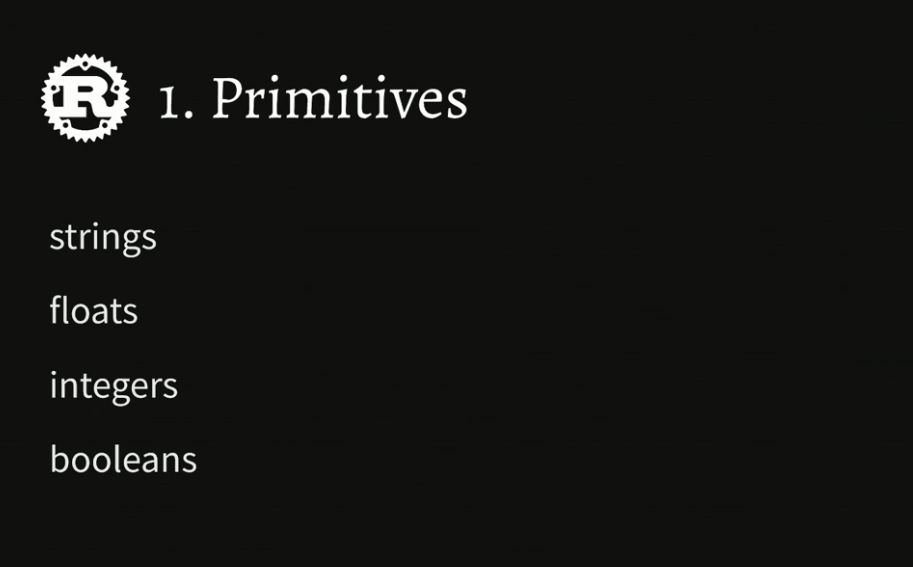

<h1 align="center"> </br> Introduction </h1>

<h3 align="center">This chapter highlights the primitive types in Rust </h3>



###  Table of Contents
  - [Strings](#strings)
  - [Floats & Mutability](#floats-mutability)
  - [Rust Q&A](#rust-q-a)
  - [Numeric Types & Annotations](#numeric-types-annotations)
  - [Booleans, Conditionals, Statements](#booleans-conditionals-statements)
  - [Primitives Recap Q&A](#primitives-recap-q-a)
  - [Primitives Solution](#primitives-solution)

---

### Strings

<details>
  <summary>Learn More..</summary>

  - **Hello World!**
    - below shows how to declare a program in rust, starts with the main function (similar to go or java)
    - main does not take any arguments
    - the below example uses rust print statement `println!` and passes in a string to be printed to the console
    - you would put the main function in a file named `app.rs` .rs is rusts file extension

    ```rust
        fn main() {
            println!("Hello, World!");
        }
    ```

    - to run a rust program we use `rustc`
      - from the root dir of the program run `rustc app.rs` (rustc and the file name to run)
      - this will compile our code and produce a binary file which is something like
        - `app.exe` on windows
        - `app` on mac and linux

    - *macros*
      - since this course will not cover macros, here is a brief
        - in the above example, notice the `!` after the println, this denotes println is a macro (different from the `main()` function)
        - a macro in Rust is a way to do something like a function call, where instead a macro does some code transformation (it is a way to **wrap** the code we write with some *abstracted* rust code kind of like a decorater in python or java with one key difference)
          - Rust has `0 cost abstractions` due to how the compiler handles rust code, so using macros does not add memory or usage to our programs
          - all abstractions `macros` included are compiled down to one set of code as if our program wrote the macro itself so in the `app.exe` the macro does not exist only the code it transformed into
        - you can define your own macros in rust
        - the way to tell the difference between a function and a macro is with the `!`

     - *comments*
       - comments in rust can be written similar to go etc, with a // in front of some text

       ```rs
        fn main() {
            // this is a comment in rust
        }
       ```
     - *crates*
       - crates are rust packages, similar to an npm package in javascript
         - visit [crates.io](https://crates.io) to search for all available rust packages

  - **String Interpolation**
    - This is not a built in as a language feature like python or ruby
    - In Rust, the below example the curly braces are substituted with the values passed in the same place as arguments i.e the first curly braced is replaced with the string `greeting` since it is the first argument after the interpolation string
    - `println!` supports this as apart of its implementation as well as other ways, string interpolation is not supported across any string in Rust
      - `format!` is another way to do string interpolation
        - the second code example shows format in use
        - *Whats the difference between `println` and `format`?*
          - println will always print the string to the console
          - format will return a string, so format can be used to compose together different strings that are returnable in your program like in a function or to a client

    ```rs
        fn main () {
          let greeting = "Hello";
          let subject = "World";

          printin!("{｝，{}!"，greeting, subject)；
        }
    ```

    ```rs
      let subject = "World";
      let greeting = format!("Hello, {}!", subject)
    ```

    - *panic*
      - Panic also supports string interpolation
      - the below example shows a program that puts the crash reason inside a panic message
        - *What is panic used for?*
          - panic is used when you want to end the program, "We are done I can no longer run the program quit/kill the program"
          - in the below example since the panic runs before the last println, the println statement wouldnt actually run since the app will quit at panic
          - panic is not usually used in production applications
            - if familiar with go, panic works the same here
      ```rs
        fn main () {
            let crash_reason = "Server wanted a nap.";

            panic!("I crashed! {}", crash_reason) ;

            println! ("This will never get run.");
        }
      ```

</details>

### Floats & Mutability


<details>
  <summary>Learn More..</summary>

  - **Floats**
    - *String interpolation*
      - string interpolation works not only with string but floats/numbers as well
      - The below example will take the operation in the first argument after the string interp. and substitute the curly braces with the value from the operation

    ```rs
     fn main() {
        let x = 1.1;
        let y = 2.2;

        println!("x times y is {}", x * y)
     }
    ```
    - *output*
      - `x times y is 2.4200000000004`
        - In Rust, when performing a numerical operation this is an example of the result, traditional IEEE `binary floating-point type`
          - this is because binary floats are very fast to get the expected answer while decimal math would come at a significant performance cost since this requires more overhead for a cpu to process
          - full reference from rust docs [Numeric Types](https://doc.rust-lang.org/reference/types/numeric.html?highlight=IEEE#floating-point-typesl)

  - **Mutability**
   - variables are immutable by default in Rust
   - in the below example this could be valid javascript code, where assign x to 1.1 and reassign it to 2.2
     - in Rust this would result in a compiler error

     

     - `let` works similarly to const, once a value is assigned to a variable with the let keyword it is not reassignable or in rust it is known as `immutable` variable
       - let in rust means both const and immutable
         - this means you can not reassign to it OR mutate any data within the value itself

    ```rs
    let x = 1.1;

    x = 2.2;
    ```

    - to make x mutable, the below code shows how rust handles this behavior
      - using the `mut` keyword, rust allows for changes to the variable and content/structure changes where a specifiic value needs to change

    ```rs
    let mut x = 1.1;
    x = 2.2;
    ```
</details>


### Rust Q&A

<details>
  <summary>Learn More..</summary>

  - *What benefits are there for macros over functions?*
    - mainly a matter of convenience, they let you do more things than functions do
      - a function gets an argument and thats all they get to work with
      - in a macro you can pass as many arguments as you want, regular functions require a defined fixed set of arguments
      - macros can not be passed around
  - *Are there performance differences between macros and functions?*
   - Yes at compile time no at run time
    - macros are slower to run at compile time because macros get expanded into a series of function calls but its no different than if you had written the function calls by hand during run time
    - macros are one of the things that can make the compile time slower in rust
  - *So using less macros would make it compile faster?*
   - Yes but this is not a common remediation
     - unless you are using alot of macros they tend not to be a real culprit of slower compilations

  - *What is the point of immutable variables?*
    - the point of immutable variables is good programming practice to default to immutability since they are less error prone
      - i.e if you dont intend to reassign a var, defining with let ensures no where in the code can x be reassigned un intentionally since the compiler will catch a mutation to an immutable item

  - *What is the dyn keyword?*
    - Rust is a statically typed language but there is a `dyn` keyword
     - relatively advanced use case
     - does not exactly work based on first thought of dynamic vs static typings

</details>

### Numeric Types & Type Annotations


<details>
  <summary>Learn More..</summary>

  - **Numeric Types**
    - In Rust, although variables can be made mutable with the `mut` keyword, the types will still remain 'immutable'
    - The below snippet shows a mutable var created with a numerical type assigned to it
      - it is then reassigned to a new numerical type (this is ok in rust)
      - it is then reassigned to a string type (this will cause a compiler error)

  ```rs
    let mut y = 2.2;

    y = 3.1;
    y = "three point one";
  ```

  - **Type annotations**
    - type annotations in rust are ways to explicity set the type for variables.
    - Rust does not require you to annotate the types to variables when using let
      - similar to go Rust is able to do type inference and can see, using the below example, x is a float and y is a float
    - in more advanced scenarios Rust compiler may enforce type annotation if the type is harder to infer about
      - the compiler will never miss or get an inferred type wrong if not annotated.. the worst case scenarios are it infers the type or does not compile and enforce type annotation


    ```rs
     fn main() {
        let x: f64 = 1.1; // f64 is a 64 bit floating point number
        let y = 2.2;

        println!("x times y is {}", x * y);
     }
    ```

    - *declaring our first function*
      - when defining functions you are required to use type annotations, in the example below the function parameters are annotated as well as the function return type
       - x is a 64 bit float
       - y is a 64 bit float
       - multiply_both returns a 64 bit float
         - return types are annotated using the `-> type` after the parameter block
      - if your function doesn't return anything you can leave the return type empty (no need for things like void etc.)

      ```rs
      fn main() {
        let answer = multiply_both(1.1, 2.2);
        println!("1.1 x 2.2 = ", answer);
            // ! means println is a macro, not a function
      }

      fn multiply_both(x: f64, y: f64) -> f64 {
        return x * y;
      }
      ```

    - *Is there a way to trick the rust compiler by saying something has the type obj or any to mutate the type?*
       - no, Rust does not have an `any` type or `obj`
       - having collections that contain multiple types is possible using `enums` which is covered in a future section
</details>


### Float Sizes


<details>
  <summary>Learn More..</summary>

  - There are two float sizes `f64` & `f32`
    - There are trade offs to using one vs the other
    - f64 can be better for calculation where precision is really important since it registers numbers at a higher bit count or 8 bytes of storage
    - f32 only has 32 bits (4 bytes) of storage, making it more memory efficient but not as accurate
  - *Why not always use f64 since it is more precise?*
    - more memory used allows for more precision
    - more memory used may slow down the program
    - I.e if you are writing a game engine and it needs to calculate millions of coordinates it starts to make a difference with how much memory you are using and cause real performance issue if using f64 everywhere instead of choosing when to use f64 where precision is needed and f32 i.e where it is not

  ```rs
  let x: f64 = 10.1 / 3.0; // f64 is a 64 bit float
  let y: f32 = 10.0 / 3.0; // f32 is a 32 bit float
  ```

  *Integers*
    - Integers are also a numerical type, the same as floats, without the decimal point (whole number, 0 or negative number)
    - Integers also have differet sizes
    - Rust has `number literals` that allow you to use different syntax when writing numbers
      - `1_000` is the same as `1,000` in rust

    ```rs
     let ninety = 90;
     let negative_five = -5;
     let one_thousand = 1_000;
     let exactly_three = 10 / 3; // this returns a whole number 3 not 3.33
     let this_will_panic = 5 / 0; // dividing by zero will cause the program to quit
    ```

  *Integer Sizes*
    *Signed Integers*
    - There are multiple integer sizes as small as `i8` (1 byte) `i128`
    - each size has a set of numbers they support
      - i8 8 bits (1 byte) -> -128 to 127
      - i16 16 bits (2 bytes) -> -32,768 to 32,767
      - i32 32 bits (4 bytes) ...
      - i64 64 bits (8 bytes)
      - i128 128 bits (16 bytes)

    *Unsigned Integers*
    - There are multiple unsigned integer sizes
    - the lowest value you can have in an unsigned integer is 0 (all positive numbers)

      - u8 -> 0-255
      - u16 -> 0-65,535
      - u32 -> 0-4,294,967,295
      - u64 -> 0-18,446,744,709,551,615
      - u128 -> 0-170...undecillion

    *What is the difference between signed and unsigned integers?*
     - signed integers have a larger range of possible numbers from negative to positive numbers
     - unsigned integers have a smaller range of possible numbers with only positive numbers being assignable to a type u<size>

   - uints are more commonly used in rust

   *char*
     - a `u32` that's been Univode validated

  *Converting numbers with as*

    - In the below example is a function that multiplies to arguments passed in, one a 64 bit int the other an unsigned 8 bit int and the function returns a 64 bit in
    - By default those are incompatible
    - Rust uses the `as` keyword to convert one numericaly value type to another
    - if this function was run as `return x * y` we get a compiler error
    - it is commonplace to use as on the larger numerical type since it can handle more data making it more flexible than the smaller numerical type, this is shown in the example below
    - this can be used to convert between ints and floats

  ```rs
    fn multiply(x: i64, y: u8) -> i64 {
        return x * (y as i64);
    }

    fn divide(x: i32, y: u16) -> f64 {
        return x as f64 / y as f64;
    }
  ```

</details>

### Booleans


<details>
  <summary>Learn More..</summary>

  - Rust has 2 boolean type
    - true
    - false
  - Behind the scenes booleans are just u8s, which means you can use `as` to convert a boolean to a u8
    - *true as u8* - evaluates to 1 at runtime
    - *false as u8* - evaluates to 0 at runtime

  ```rs
    let should_we_go_fast = true;
    let should_we_go_slow = false;

    1 == 2 // evaluates to false
  ```

  - *Comparisons*
    - `==` is used to compare two values
      - this is known as a structural equality, meaning if you take two structures or collections and compare them rust will compare all of the contents of the collections
      - this is different from reference equality in some other languages
      - double equals is the only equals in rust, no triple equal etc.

  - *Conditionals*
    - conditionals in rust do not require you wrap them paranthesis
    - conditional logic in rust must be wrapped in curly braces
    - the if must be a boolean, there are no truthy statements in rust
    - else if is also supported in rust

  ```rs
  if cat > 1 {
    println!("Multiple cats!");
  } else {
    println!("Need more cats!");
  }

   if cat > 1 {
    println!("Multiple cats!");
  } else if cats > 1_000 {
    println!("Too  many cats!");
  }
  ```

    - *Statements and Expressions*
      - An **expression** in rust is something that evaluates to a value
        - `cats > 1_0000` this will evaluate to either true or false (a value)
        - this also breaks down to sub expressions
          - `cat` is an expression and `1_0000` is an expression and they come together to make an expression

      - A **statement** in rust does not evaluate to a value
        - `println!("Multiple Cats");`
        - statements will typically end with a semicolon

    - *Why does this distinction matter?*
     - In some cases the rust compiler gives you conveniences when you choose an expression over a statement
     - In the below example, if we compare this to javascript, the return statement is needed
     - In rust as long as the expression `x*y` is what you want to return the return statement is not required
       - the compiler will infer that this should be returned
       - In rust if a function ends with an expression rather than a statement, the function will automatically return the expression
       - this only works without a ;, adding a semicolon to an expression in rust tells the compiler this line is a statement
       - to get the return without the return keyword leave out the return and the semicolon

     ```rs
     fn multiply_both(x: f64, y: f64 -> f64 {
        return x*y
     }
     ```

    - *Expression vs Statements apply to conditionals too!*
      - instead of using print statements like the above, removing the println and semicolons we can return the strings themselves and create something similar to a ternary in javascript
      - the below example based on the condition, we store the string in message
        - *note*
          - the semicolon at the end of the entire statement is required since let is a statement

    ```rs
        let message = if cat > 1 {
         "Multiple cats!"
        } else if cats > 1_000 {
          "Too many cats!"
        } else {
          "Need more cats!"
        };
    ```
</details>

### Statements & Expressions Q & A


<details>
  <summary>Learn More..</summary>

  - *If a function contains more than one expression can we utilize the expression return?*
    - the rule is you can have as many statements in a row, with only one expression at the end
    - multiple expressions will result in a compiler error
  - *For early returns can expression returns be utilized?*
    - no for early returns use the return keyword
  - Type errors occur when comparing the string foo is greater than 1, no cross comparison types

  - *Rust does not have a concept of none, null, nil, undefined*
</details>


### Primitives Recap and Q & A


<details>
  <summary>Learn More..</summary>

  - *What is the difference between traits and macros?*
    - traits and macros have nothing to do with eachother
       - traits
         - similar to classes or interfaces, adds code reuse and flexibility
       - macros
         - something that happens at compile time, rust executes some logic inside the macro which expands it into a serious of other function call i.e `format!` `println!`

   - *When using `y as i64` to convert to a new i64 value does rust copy that i64 to a new i64 in memory?*
     - yes, it has to since whatever the numerical type in assigned to y is being converted to will be a new size
     - although this is the process it is trivially fast to convert and use `as`
</details>


### Primitive Exercises

[Primitive Exercise](../rust-1.51-workshop/part1/)
