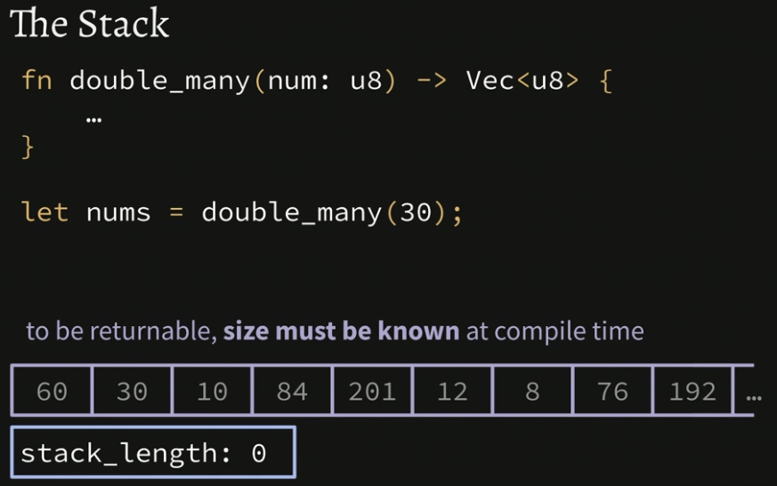
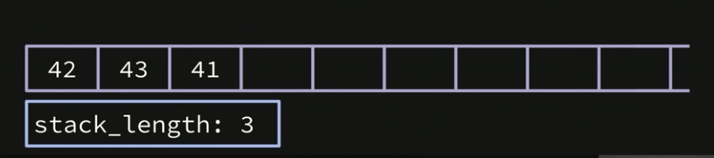

<h1 align="center"> </br> Vectors</h1>

<h3 align="center">This chapter cover Vectors in Rust</h3>


###  Table of Contents
  - [Vectors](#vectors)
  - [Stack Memory](#stack-memory)
  - [The Heap](#the-heap)
  - [Vectors Recap and Q & A](#vectors-recap-q-a)
  - [Vectors Exercise](#vectors-exercise)


### Vectors


<details>
  <summary>Learn More..</summary>

  - *Vector*
    - Vectors are another way to structure data in rust and work similarly to arrays
      - **like** arrays each element in a vector must be the same type
      - **unlike** arrays a vectors length is dynamic and can change at run time
      - **like** other referencable types in rust vectors are ofcourse immutable by default
        - this means the `.push` methods called on the years vec in the below example would result in a compilation error if the years vec was not prefixed with the `mut` keyword
      - the example below shows a mutable `years` vec, to define a vector annotate the type of var as `Vec<T>` where T is the type all elements in the array should be i.e i32, u64 etc. then assign a vec to the var using the vec macro with the list of items in square brackets i.e `let my_vec: Vec<i32> = vec![1000,2000]`

    ```rs
      let mut years: Vec<i32> = vec![1995, 2000, 2005];

      years.push(2010); // Now years has 4 elements, ending in 2010
      years.push(2015); // Not years has 5 elements, ending in 2015

      println!("Number of years: {}", years.len());
    ```

  - *usize*
    - is a dynamic type in rust that assigns the u<type> to a value according to the system its compiled on, i.e on a 32bit system setting a value as `usize` would return a `u32` on a 64 bit system it will return a `u64`
     - this is a way to set the unsigned integer type without predefining or hardcoding it
       - seems like a way to ensure you get the most out of the system?
     - usize can be assigned to a val as shown below...

  ```rs
   let length: usize = years.len(); // whenever storing the length of most data structures it returns a usize
  ```

  - *Vector vs Arrays*
    - vectors have dynamic length, arrays length are fixed and cannnot change at run time
    - both vectors and arrays are iterable
    - *Why would you want to use an Array in Rust if Vecs are more flexible?*
      - the tradeoffs between arrays and vecs make arrays a viable option despite not being as flexible, particulary around [memory](#stack-memory)

    ```rs
    let nums: [u8; 3] = [1, 2, 3];
    let nums: Vec<u8> = vec![1, 2, 3];

    for num in nums { ... }
    ```

</details>


### Stack Memory



<details>
  <summary>Learn More..</summary>

  - *Memory*
    - the section starts off reviewing the memory lesson here ->
      - [memory](../collections/README.md)
    - this section covers the stack vs the heap
      - Particularly that in practice every process divides memory storage in a couple of different regions, one the stack and the other the heap and the purpose of it

  - *The Stack*
    - The stack is a data structure used in programs as a way of dealing with function calls/passing memory between functions
     - In order to return something on a stack the **entire** returnable size must be known at compile time *(more on this at the end of this section)*
    - lets say we have a global variable called stack_length, it starts out with empty memory cells aka bytes

    

    - We will define a couple of functions and invoke
      - notice that these functions have some `memory traffic` (the params that allow for passing numbers between the different functions)

        ```rs

        fn increment_decrement(num: u8) {
            print_nums(num + 1, num - 1);
        }

        fn print_nums(x: u8, y: u8) { ... }

        increment_decrement(42);

        ```

    - *What happens under the hood in terms of memory when the computer runs this above code when functions have `Memory traffic`?*
      - the first call to `increment_decrement(42)` tells the cpu to put 42 on to the stack, which changes the 'global stack_length' above from 0 to 1, with 42 being on the stack now
        - notice it is added to the first available cell/byte in the stack

      

      - then the program moves on and the `increment_decrement` function runs
        - notice the `print_nums` function call inside increment_decrement which needs the `num` arg value so that it can perform the increment and decrement logic
        - The function can retrieve the value `42` from our function call because it exists on the stack in our programs memory
        - the execution of `print_nums` also adds the incremented 42 and decremented 42 to the stack, so the result of the operations `43` and `41` giving the program a new stack length of 3

        


    - Since Stacks are Last In First Out (LIFO) a typical program can always reference the bytes the arg ref points to according to execution context (the order in which the functions are called)

        

        <details>
          <summary>Learn More..</summary>

        

        - Whenever a function is invoked that functions values get pushed on to the stack
          - The params/args in the functions themselves reference the byte on the stack the val lives in using the param offset i.e `fn func(num: u64, num: u64) { ... }` -> the first arg calls `[stack_bytes][stack_length - 1]` the second arg calls `[stackbytes][stack_length - 2]` if there was a third arg it would reference the `- 3` place in the stack

        - In practice most programs will have **Garbage** on the stack, which refers to values that are not *In use* but have not been removed, this garbage usually does not effect running programs because of the above procedures

        - *in the context of Rust there may be some more happening here since the execution context does not matter as far as the compiler is concerned (you can execute and call functions/methods regardless of what order they are defined, similar to what es6 introducted to JS)*
        </details>


    - *What if I want to Return something in a function?*
      - lets use the below code as the example for the val we want to return.. the result of `num * 2`

        ```rs
        fn double_and_return (num: u8) -> u8 {
            return num * 2;
        }

        let x = double_and_return(30);
        ```

      - Returning items works similarly to the prior example with one exception
        - Since the program set a return value for the function `-> u8` when adding the `30` to the stack during the function invocation the program additionally will leave space for a return value (an extra byte in memory)
        - the `30` or value passed into the function is set on the second cell/byte in the stack and the first cell/byte is reserved for what val will be returned

       

    - **What If I want to return a `Vec` of u8s?**
      - Remember from the previous section, Vecs are not of fixed length and we do not know how big or small the vec will be until the function is run, so the question is how many slots to reserve for the vec?
        - Since a stack requires a known returnable size at compile time, the elements of a vec are not stored on the stack but a struct that represents some metadata about the Vec is, as shown in the code example below
          - the struct that is returned has a fixed length, but it is only representative data not the actual values themselves
            - Vecs store the actual elems on the [heap](#the-heap)

      ```rs
      fn double_many(num: u8) -> Vec<u8> {
        ...
      }

      // representation of the Vec struct on the stack
      struct VecMetadata {
        first_elem_index: usize, // the index into memory of the first elem
        length: usize, // the length of the vec
        capacity: usize, // ??
      }

      ```

</details>

### The Heap


<details>
  <summary>Learn More..</summary>

  - *Heaps*
    - A heap is a data structure used to store data that may need to grow or shrink in size at run time
      - It Is used as a helper for the stack to provide the stack more flexibility
      - This section will finish the *How are items in vecs returned from the stack/why arrays are still useful/performance implication of using an array vs a vec questions from the previous two sections with the code examples below*

      

      - The above example shows a struct for a nums vec and how the heap and stack are used to store/reference the memory of the nums vec
        - the struct is indexed on the stack
        - the elements of the nums vec are indexed on the heap
          - i.e for `let nums = vec![1, 2, 3]` the first_elem_index is set as the index the rust runtime found to store the first element of the vec in on the heap
          - the length (which is called when calling `.length`) is set as the length of elements in the vec (this also tells the program how many indexes forward on the heap to look for the elems in this vec)

      - *What if we want to push a new element to the vec?*

       

       - to push nums to a `vec` in rust you call the .push method on the vec i.e `nums.push(85)` and add the value to add to the vec as an argument, similar to arrays in other languages
         - Pushing a new element/value to a vec can be successful IF the heap has an additional slot in memory available immediately after the last element in the vec
           - If another function call or code executes in the program that occupies that byte/slot on the heap the push will potentially overwrite the existing memory of the other function. *This does not happen in practice as Rust handles re allocation as explained below*

           - *How does Rust handle this and maintain performance?*
             - It uses **capacity** to set an amount of indexes to ensure exist on the heap next to each other before setting the vecs values in memory, even if the vec length is less than the capacity set
               - to set a vec capacity in Rust, use the `with_capacity` method as shown below
                  - this is considered best practice in rust, although I can not imagine knowing the capacity ahead of time in most programs
                     - If the capacity is not known ahead of time (you do not set `::with_capacity` when declaring a vec) Rust automatically handles copying and re allocating memory on the heap if a new item is added and the next slot/byte on the heap is not available (this has perf costs)
                     - Rust also has a `.clone()` method that can be called on data structures like vecs to give more control over how data is copied and reallocated if needed

               ```rs
               let nums = Vec::with_capacity(5) // only store the vals of the nums vec on the heap if there a 5 contiguous slots available
               ```

              >  - In conclusion, the heap is more flexible but adds significant complexity and can have effects on performance of programs since dealing with the heap means the cpu has to perform additional operations to store data needed for the program to run
                  > - In **contrast** the array, since it is of fixed length, can easily index its elems right on to the stack and return them following the lifo nature of the stack

        

</details>


  ### Vectors Exercise

  [Exercise](../chapter-exercises/part4/)
